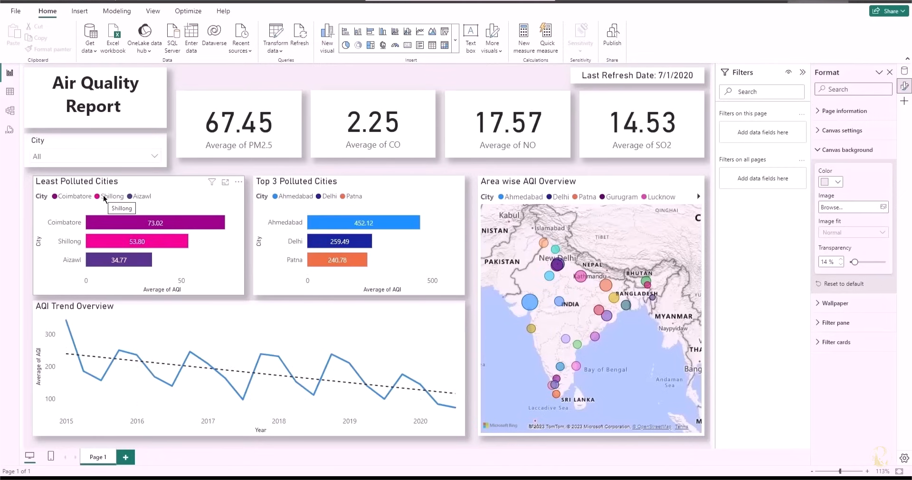

# AirQuality-PowerBI-Dashboard
This project represents interactive Power BI dashboard analyzing air quality data across regions.

**Key Features**
- Dashboard highlights pollution trends (PM2.5, PM10, etc.)
- Interactive slicers and visual storytelling
- Focus on real-time, city-wise comparison

**Dashboard Preview**

Tools Used
**Power BI**
Dataset: Sample air quality data Tutorial guided by *Pavan Lalwani* on YouTube

Author
**Faryal Naz**  
[LinkedIn Profile](https://www.linkedin.com/in/faryal-naz)

